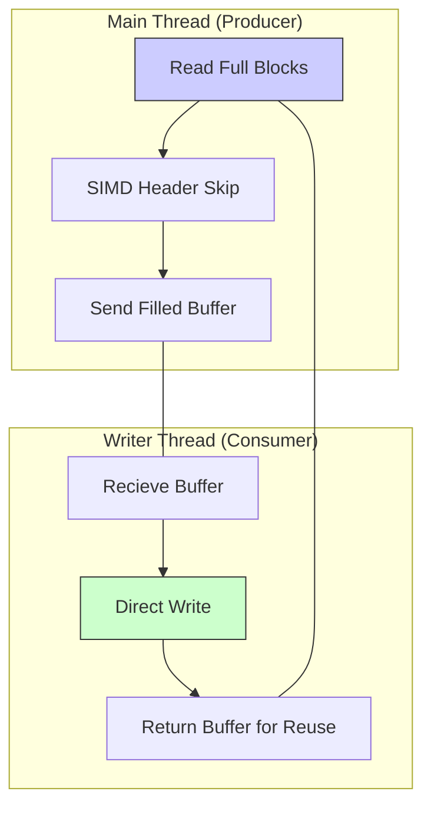

# ⚡ Flash Merge CSV

> **The fastest, lowest-overhead way to merge massive CSV datasets in Rust.**

[](https://opensource.org/licenses/MIT)
[](https://www.rust-lang.org/)
[]()

`flash-merge-csv` is a production-grade CLI tool designed for one specific task: merging multiple 10GB+ CSV files into a single file as fast as your hardware allows. By leveraging asynchronous pipeline I/O, SIMD-accelerated byte searching, and platform-specific kernel hints, it bypasses the bottlenecks typical of standard CSV processing libraries.

---

## 🚀 Key Features

- **⚡ Async Pipeline I/O** – Decouples disk reads from disk writes. While the reader thread is filling a buffer, the writer thread is dumping its predecessor to disk.
- **♻️ Zero-Allocation Ring Buffer** – Uses a pre-allocated pool of 8 large buffers (up to 64MB each). In "Raw" mode, zero heap allocations occur in the hot loop.
- **🏎️ SIMD-Accelerated Header Skipping** – Uses `memchr` (AVX2/NEON) to find headers in microseconds without UTF-8 validation or line-by-line string copies.
- **💾 Low Memory Footprint** – Fixed memory overhead (default ~512MB for peak performance, tunable down to <32MB), regardless of merging 10GB or 10TB.
- **💽 HDD/SSD Optimization** –
  - **Windows**: Uses `SetFileValidData` and `FILE_FLAG_SEQUENTIAL_SCAN` for physical pre-allocation and aggressive read-ahead.
  - **Linux**: Uses `posix_fadvise(SEQUENTIAL)` to hint the kernel to prep cache.
- **🛡️ Optional Validation** – Switch to "Validated Mode" to guarantee schema consistency and report malformed rows.

---

## 📦 Installation

### Prerequisites

- [Rust Toolchain](https://rustup.rs/) (Stable)

### Build from Source

```bash
git clone https://github.com/your-username/flash-merge-csv.git
cd flash-merge-csv
cargo build --release
```

The optimized binary will be located at `target/release/flash-merge-csv`.

---

## 🚀 Usage

### Simple Merge

Merge all CSVs in a folder into a single file with a single header:

```bash
flash-merge-csv data/*.csv --output combined.csv
```

### High-Integrity Merge

Parse every row, verify column counts, and skip malformed data:

```bash
flash-merge-csv data/*.csv -o clean_data.csv --validate
```

### Tuning for Top Performance

For NVMe SSDs or massive datasets on HDDs:

```bash
# Disable progress UI to save CPU cycles + set massive buffer
flash-merge-csv data/*.csv -o output.csv --buffer-size 67108864 --no-progress
```

---

## ⚙️ Configuration Options

| Flag            | Short | Default             | Description                                |
| :-------------- | :---: | :------------------ | :----------------------------------------- |
| `<INPUT_FILES>` |   —   | REQUIRED            | Paths to CSV files (supports shell globs)  |
| `--output`      | `-o`  | `merged_output.csv` | Path for the resulting file                |
| `--has-header`  |   —   | `true`              | If true, strips headers from files 2..N    |
| `--delimiter`   | `-d`  | `,` (44)            | ASCII byte for the delimiter               |
| `--buffer-size` |   —   | `67108864` (64MB)   | Size per pipeline buffer (8 buffers total) |
| `--validate`    |   —   | `false`             | Enable CSV parsing and schema validation   |
| `--no-progress` |   —   | `false`             | Hide the progress bar UI                   |

---

## 🏗️ Architecture: Why it's so fast

### Traditional Approach (Slow)


_Bottleneck:_ Sequential I/O blocks on CPU-heavy parsing and validation.

### Flash Merge "Raw" Mode (Fast)

`flash-merge-csv` uses a **Producer-Consumer pipeline** via `crossbeam-channel`:



1.  **I/O Parallelism**: Read and Write syscalls happen on separate threads.
2.  **Kernel Hints**: `FILE_FLAG_SEQUENTIAL_SCAN` tells the OS we will never seek, so it reads ahead aggressively into the page cache.
3.  **No Fragmentation**: On Windows, we pre-allocate the physical space on disk to ensure a continuous stream of sectors, which is massive for HDDs.

---

## 🔧 Performance Tips

| Hardware         | Recommendation        | Reason                                   |
| :--------------- | :-------------------- | :--------------------------------------- |
| **NVMe SSD**     | `--buffer-size 64MB`  | Large IOPS throughput                    |
| **Standard HDD** | `--buffer-size 128MB` | Minimizes head movement (Seek)           |
| **Low RAM**      | `--buffer-size 8MB`   | Keeps memory usage < 100MB               |
| **Dirty Data**   | `--validate`          | Safely skips rows with column mismatches |

---

## 📁 Project Structure

- `src/main.rs`: Entry point and CLI setup.
- `src/cli.rs`: Command-line argument definitions using `clap`.
- `src/merger.rs`: The "heart" of the tool — contains both the Raw Pipeline and Validated engines.
- `testdata/`: Sample CSV files for testing.

---

## 📄 License

This project is licensed under the **MIT License**. Check the [LICENSE](LICENSE) file for details.

---

_Created by Bao Duong_
